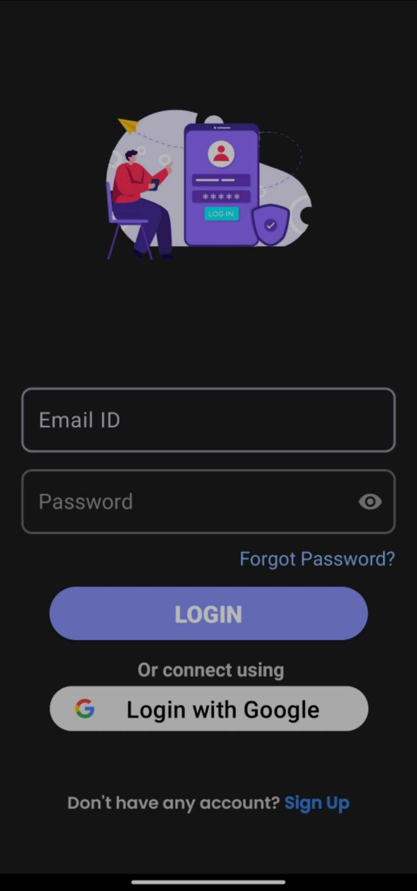
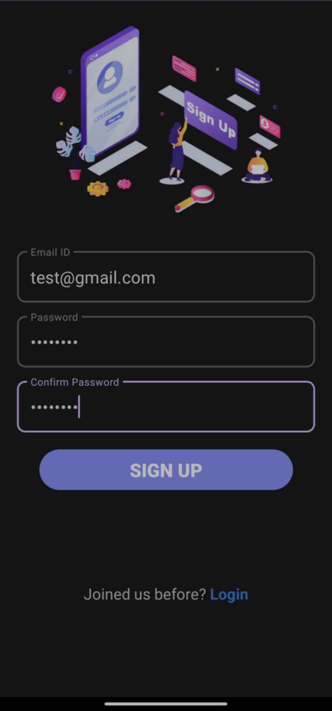
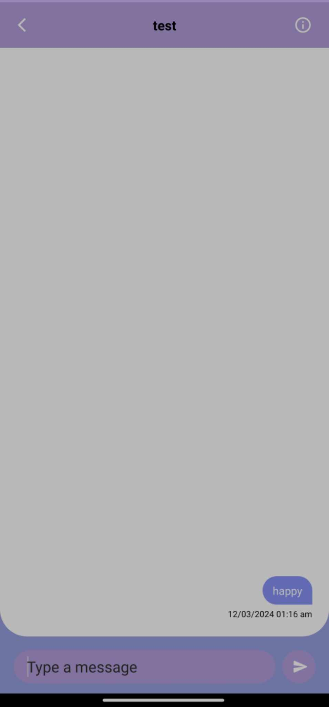

# Chat App using Firebase

This is a chat application built using Firebase for data storage. It allows users to send and receive messages in real-time.

## Features

- User Registration: Users can create an account by providing their email and password.
- User Authentication: Users can log in using their registered email and password.
- Real-time Messaging: Users can send and receive messages in real-time.
- Message Persistence: All messages are stored in Firebase, ensuring that they are accessible even when users log out and log back in.
- Online/Offline Status: Users' online/offline status is tracked using Firebase Realtime Database.
- Notifications: Users receive notifications when new messages are received.

## Dependencies

The app uses the following dependencies:

- Firebase SDK: To interact with Firebase services such as Authentication, Realtime Database.

## Screenshots

  
  
  

